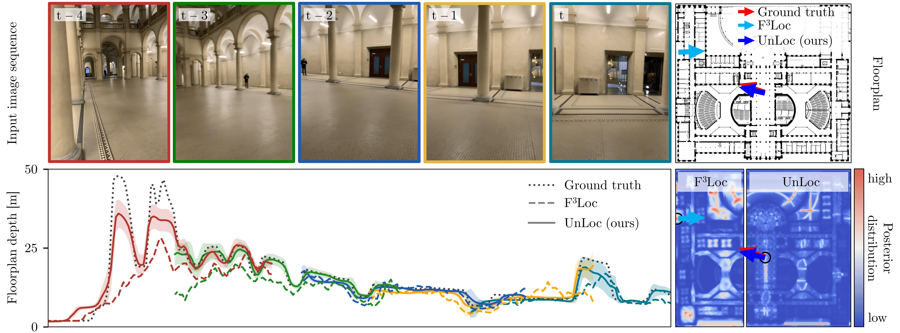
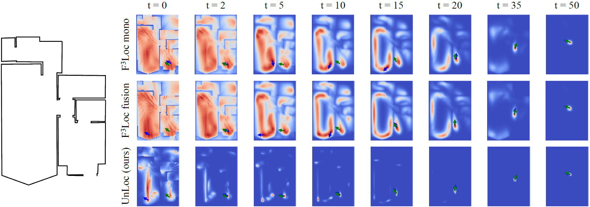

<h1 align="center">
  <ins>UnLoc: </ins><br>
  Leveraging Depth Uncertainties for<br> Floorplan Localization
</h1>


<p align="center">
  Matthias&nbsp;Wüest ·
  <a href="https://francisengelmann.github.io/">Francis&nbsp;Engelmann</a> ·
  <a href="http://miksik.co.uk/">Ondrej&nbsp;Miksik</a> · <br/>
  <a href="https://www.microsoft.com/en-us/research/people/mapoll/">Marc&nbsp;Pollefeys</a> ·
  <a href="https://cvg.ethz.ch/team/Dr-Daniel-Bela-Barath">Daniel&nbsp;Barath</a>
</p>


<p align="center">
  <br/>
</p>
<h3 align="center">
  <a href="https://www.arxiv.org/pdf/2509.11301">Paper</a> |
  <a href="https://drive.google.com/file/d/1yk7iULUx5EL7vfFWI9705vqForoFUA4d/view?usp=sharing">Poster</a> |
  <a href="#citation">Citation</a>
</h3>


---

<p align="center">
  
  <br>
  <em>
    UnLoc predicts floorplan depth and uncertainty from an image sequence,
    generating a probability distribution over camera poses and outputting the most likely one.
  </em>
</p>


## Overview

We present **UnLoc**, an efficient data-driven solution for sequential camera localization within floorplans.
Unlike recent methods, UnLoc explicitly models the uncertainty in floorplan depth predictions and leverages off-the-shelf monocular depth networks pre-trained on large-scale datasets. Experimental results show substantial improvements in localization accuracy and robustness over existing state-of-the-art methods on multiple datasets.

<p align="center">
  
  <br>
  <em>
    Posterior evolution showing how UnLoc achieves fast convergence to the true pose. 
  </em>
</p>

---
## Attribution

This code builds upon the [F³Loc](https://github.com/felix-ch/f3loc) framework by Chen et al. Our work introduces explicit uncertainty modeling in floorplan depth predictions and leverages pre-trained monocular depth networks, achieving substantial improvements in localization accuracy. We thank the authors for making their code publicly available.

---
## Setup
*Environment, backbone, checkpoints, and datasets — everything you need before running the code.*

### Installation

Clone this repository (with submodules) and install the dependencies:

```bash
git clone --recurse-submodules https://github.com/matthias-wueest/UnLoc
cd UnLoc
conda env create -f environment.yml
conda activate unloc
```

If you already cloned without `--recurse-submodules`, initialize the submodule manually:

```bash
git submodule update --init --recursive
```

Next, complete the [Depth Anything v2 backbone](#depth-anything-v2-backbone) step.

### Depth Anything v2 backbone

UnLoc uses [Depth Anything v2](https://github.com/DepthAnything/Depth-Anything-V2) as a frozen backbone. It is included as a git submodule pinned to a specific upstream commit, so no manual cloning is needed — the steps in [Installation](#installation) already fetched it into `depth_anything_v2/`.

#### Download a backbone checkpoint

Download the **metric indoor (Hypersim)** checkpoint for the encoder size you plan to use and place it in `depth_anything_v2/checkpoints/`:

```bash
mkdir -p depth_anything_v2/checkpoints
cd depth_anything_v2/checkpoints

# Pick one (or all) depending on which UnLoc checkpoint you want to run:
wget https://huggingface.co/depth-anything/Depth-Anything-V2-Metric-Hypersim-Large/resolve/main/depth_anything_v2_metric_hypersim_vitl.pth
wget https://huggingface.co/depth-anything/Depth-Anything-V2-Metric-Hypersim-Base/resolve/main/depth_anything_v2_metric_hypersim_vitb.pth
wget https://huggingface.co/depth-anything/Depth-Anything-V2-Metric-Hypersim-Small/resolve/main/depth_anything_v2_metric_hypersim_vits.pth
cd ../..
```

| Encoder | Size    | Used by UnLoc checkpoint                              |
|---------|---------|-------------------------------------------------------|
| `vitl`  | ~1.3 GB | `unloc_gibson_vitl.ckpt`, `unloc_lamar_vitl.ckpt`     |
| `vitb`  | ~380 MB | `unloc_lamar_vitb.ckpt`                               |
| `vits`  | ~100 MB | `unloc_lamar_vits.ckpt`                               |

After this step, the layout should look like:

```
UnLoc/
├── depth_anything_v2/                    # submodule
│   ├── depth_anything_v2/                # inner package (upstream structure)
│   │   └── dpt.py
│   └── checkpoints/
│       └── depth_anything_v2_metric_hypersim_vitl.pth
├── modules/
├── utils/
└── ...
```

### UnLoc checkpoints

Download the UnLoc model checkpoints from [this Google Drive folder](https://drive.google.com/drive/folders/1Qb0IkKbqLyBpHbptTTX8WZI8NElTQZQc?usp=sharing) and place them in a `logs/` folder under the repo root:

```
UnLoc/
├── logs/
│   ├── unloc_gibson_vitl.ckpt   # Gibson, large depth encoder
│   ├── unloc_lamar_vitl.ckpt    # LaMAR HGE, large depth encoder
│   ├── unloc_lamar_vitb.ckpt    # LaMAR HGE, base depth encoder
│   └── unloc_lamar_vits.ckpt    # LaMAR HGE, small depth encoder
```

*Alternative (command-line):* install `gdown` and run:

```bash
pip install gdown
mkdir -p logs
gdown --folder "https://drive.google.com/drive/folders/1Qb0IkKbqLyBpHbptTTX8WZI8NElTQZQc" -O logs
```

### Datasets

#### Gibson

Download the Gibson datasets (from the F³Loc paper) [here](https://libdrive.ethz.ch/index.php/s/dvKdj8WhmZuIaNw).
Use the dataset **`gibson_f`** (single views) for training and **`gibson_t`** (long trajectories) for evaluation.

Place the dataset under the data folder:

```
UnLoc/
└── data/
    └── Gibson_Floorplan_Localization_Dataset/
        ├── README.md
        ├── gibson_f/
        ├── gibson_t/
        └── desdf/        # precomputed raycast lookup
```

<a name="lamar-hge"></a>
#### LaMAR HGE

The LaMAR HGE dataset is a customized version of the iOS sessions of the [LaMAR benchmark](https://github.com/microsoft/lamar-benchmark) processed against the HGE building floorplan. The HGE floorplan is copyright-protected and we are not permitted to redistribute it.

**Non-ETH readers:** without the floorplan you can still:
- Fully reproduce our **Gibson** results — Gibson is public and our Gibson checkpoint is released.
- Inspect our released **LaMAR HGE checkpoints** (`unloc_lamar_{vits,vitb,vitl}.ckpt`) to examine the trained models.

<details>
<summary><b>Building the LaMAR HGE dataset (ETH members)</b></summary>

**Obtaining the floorplan.** The HGE floorplan is available [here](https://ethz.ch/staffnet/en/service/rooms-and-buildings/building-orientation/gebaeude.html?args0=HG). ETH Zurich members should have access. Appendix A.1.2 of the paper describes how we pre-edited it (removal of room numbers, stairs, doors, etc.).

**Building the dataset.** Once the pre-edited floorplan is available, run the two provided scripts in `tools/`:

**Step 1** — Build the dataset sessions (poses, Euler angles, depth, images):

```bash
python tools/01_create_lamar_hge.py \
    --floorplans-dir path/to/floorplan_dir \
    --session-dir path/to/LaMAR/HGE/HGE/sessions/map \
    --target-dir ./data/LaMAR_HGE/lamar_hge
```

**Step 2** — Build the DeSDF volume (Directional Euclidean Signed Distance Field: a
precomputed raycast lookup) and distribute it to each test session folder:

```bash
python tools/02_create_desdf_hge.py \
    --floorplan path/to/floorplan_dir/map_HGE.png \
    --split-yaml ./data/LaMAR_HGE/lamar_hge/split.yaml \
    --output-dir ./data/LaMAR_HGE/desdf
```

Place the two parts under the data folder as follows:

```
UnLoc/
└── data/
    └── LaMAR_HGE/
        ├── lamar_hge/
        │   ├── split.yaml                 # train/val/test session partition
        │   └── <session_name>/
        │       ├── rgb/
        │       │   ├── 00000-0.jpg        # image
        │       │   └── ...
        │       ├── poses.txt              # (x, y, theta) per line
        │       ├── euler_angles.txt       # (roll, pitch, yaw) per frame
        │       ├── depth90.txt            # 90-column floorplan depth
        │       └── map.png
        └── desdf/
            └── <session_name>/
                └── desdf.npy              # one copy per session
```
</details>

---
## Usage
*Commands for evaluation and training.*

### Quick start (Gibson)

The fastest way to verify everything works is to run evaluation on Gibson(t) with our released checkpoint. Gibson is publicly available and reproduces the main Gibson results from the paper (Table 1).

```bash
python evaluate.py \
    --dataset_path ./data/Gibson_Floorplan_Localization_Dataset \
    --dataset gibson_t \
    --checkpoint_path ./logs/unloc_gibson_vitl.ckpt
```

Expected result: SR@1m = 97.3% on T=100 sequences (Table 1 of the paper).

### Evaluation on LaMAR HGE

Requires access to the floorplan — see the [LaMAR HGE](#lamar-hge) dataset section.

```bash
python evaluate.py \
    --dataset_path ./data/LaMAR_HGE \
    --dataset lamar_hge \
    --checkpoint_path ./logs/unloc_lamar_vitl.ckpt
```

### Training

**Gibson**

```bash
python train.py \
    --dataset_path ./data/Gibson_Floorplan_Localization_Dataset \
    --dataset gibson_f
```

**LaMAR HGE**

```bash
python train.py \
    --dataset_path ./data/LaMAR_HGE \
    --dataset lamar_hge
```

---
## <a name="citation"></a>Citation

If you use this code, please cite both our work and the original F³Loc framework:

```bibtex
@InProceedings{wueest2026unloc,
  author    = {Wueest, Matthias and
               Engelmann, Francis and
               Miksik, Ondrej and
               Pollefeys, Marc and
               Barath, Daniel},
  title     = {UnLoc: Leveraging Depth Uncertainties for Floorplan Localization},
  booktitle = {Proc. ICLR},
  year      = {2026}
}

@InProceedings{chen2024f3loc,
  author    = {Chen, Changan and
               Wang, Rui and
               Vogel, Christoph and
               Pollefeys, Marc},
  title     = {F $\^{3}$ Loc: Fusion and Filtering for Floorplan Localization},
  booktitle = {IEEE/CVF Conference on Computer Vision and Pattern Recognition},
  year      = {2024}
}
```

## License

This project is licensed under the MIT License — see the [LICENSE](LICENSE) file for details.